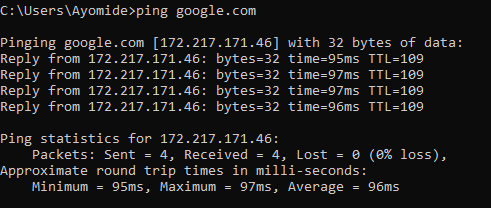
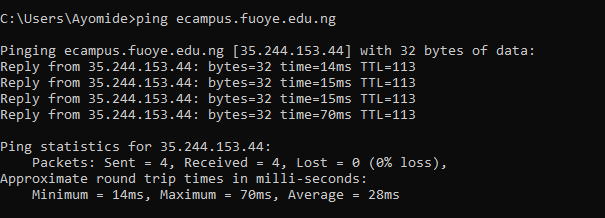
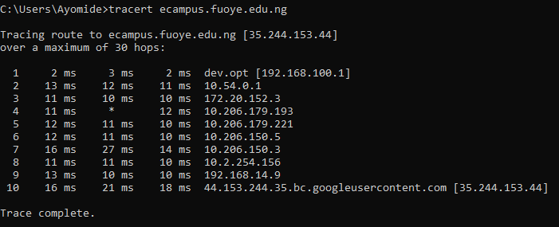
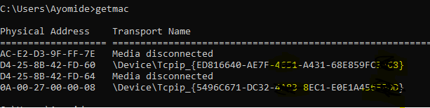

# Day 1 - Networking Fundamentals

## Objective

To understand the fundamentals of computer networking and use Windows networking tools to inspect my local system and test connectivity to remote servers.

---

## Topics Covered

- What is a Computer Network?
- LAN (Local Area Network)
- WAN (Wide Area Network)
- IP Addresses
- DNS (Domain Name System)
- Routers
- HTTP vs HTTPS
- ICMP (Internet Control Message Protocol)

---

## Practical Exercises

### 1. Display Network Configuration

```cmd
ipconfig
```

**Purpose:**
Displays the network configuration of my computer, including the IPv4 address, subnet mask, and default gateway.

---

### 2. Test Internet Connectivity

```cmd
ping google.com
```

**Purpose:**
Tests connectivity to Google's servers and confirms that DNS resolves the domain name into an IP address.

---

### 3. Test Connectivity to FUOYE eCampus

```cmd
ping ecampus.fuoye.edu.ng
```

**Purpose:**
Checks whether the FUOYE eCampus server responds to ICMP Echo Requests.

**Observation:**

Unlike my previous attempt where the server did not respond, this time it replied successfully with **0% packet loss**. This showed me that a failed ping does not always mean a server is down. Network conditions, firewall rules, or server configurations can affect ping responses.

---

### 4. Trace the Route to FUOYE eCampus

```cmd
tracert ecampus.fuoye.edu.ng
```

**Purpose:**
Displays the path packets take from my computer to the destination server.

**Observation:**

The trace passed through multiple routers before reaching the destination server hosted on **Google Cloud Platform (GCP)**. One router timed out during the trace, but communication still completed successfully, showing that routers may choose not to respond while continuing to forward traffic.

---

### 5. Display MAC Address

```cmd
getmac
```

**Purpose:**
Displays the physical (MAC) address assigned to my network adapter.

---

# Key Learnings

- Learned the difference between LAN and WAN.
- Understood how DNS converts domain names into IP addresses.
- Learned how routers forward packets across different networks.
- Used `ipconfig` to identify my local IPv4 address.
- Used `ping` to verify network connectivity.
- Learned that a failed ping does **not** necessarily mean a server is unavailable.
- Used `tracert` to observe the path packets take to reach a destination.
- Identified my computer's MAC address using `getmac`.

---

# Reflection

Today's lab taught me the importance of verifying assumptions before drawing conclusions.

Initially, I believed that a failed ping meant a server was offline. After repeating the same test on another day, the server responded successfully with 0% packet loss. This showed me that firewall rules, server configurations, or temporary network conditions can influence whether a server replies to ICMP requests.

I also learned that `tracert` provides valuable insight into how packets travel across multiple routers before reaching their destination.

---

# Screenshots

## IP Configuration


---

## Ping Google



---

## Ping FUOYE eCampus



---

## Traceroute to FUOYE eCampus



---

## MAC Address

