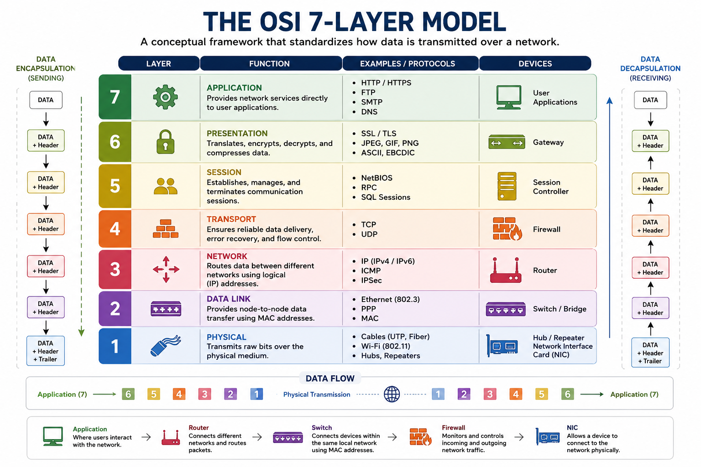

# Day 2 - Understanding the OSI Model

## Objective

Understand the OSI (Open Systems Interconnection) Model and learn how data travels across a network through its seven layers.

---

## Topics Covered

- OSI Model
- Seven Layers
- Data Encapsulation
- IP Address
- MAC Address
- Network Communication

---

## What is the OSI Model?

The OSI Model is a framework that standardizes how computers communicate over networks by dividing communication into seven distinct layers. Each layer performs a specific responsibility before passing data to the next layer.

---

# The Seven Layers

| Layer | Responsibility |
|--------|----------------|
| Application | User interaction with network applications |
| Presentation | Data formatting, encryption and decryption |
| Session | Establishes, manages and terminates communication sessions |
| Transport | Reliable or fast delivery of data using TCP or UDP |
| Network | Uses IP addresses to route packets |
| Data Link | Uses MAC addresses for communication within a local network |
| Physical | Transmits bits as electrical, wireless or optical signals |

---

# Practical Example

When I visit ChatGPT in my browser:

1. The Application Layer receives my request.
2. The Presentation Layer formats and encrypts the data.
3. The Session Layer establishes communication.
4. The Transport Layer ensures data is delivered.
5. The Network Layer routes packets using IP addresses.
6. The Data Link Layer communicates using MAC addresses.
7. The Physical Layer transmits the data as electrical signals or radio waves.

---

# Key Learnings

- Learned the function of all seven OSI layers.
- Understood the difference between IP and MAC addresses.
- Learned how routers and switches operate at different layers.
- Understood how data moves through each layer during communication.

---

# Reflection

The OSI Model helped me understand that network communication is a sequence of coordinated processes rather than a single action. Relating each layer to a real-world example, such as opening ChatGPT, made the model much easier to understand.

---

# Diagram

