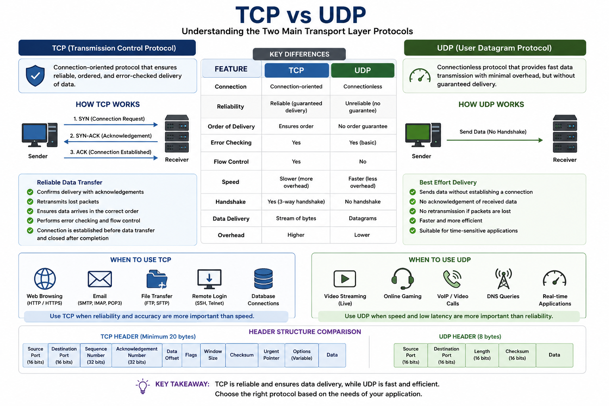

# Day 3 - TCP vs UDP

## Objective

Understand the differences between the Transmission Control Protocol (TCP) and the User Datagram Protocol (UDP), and identify when each protocol should be used.

---

## Topics Covered

- TCP
- UDP
- Reliability
- Speed
- Three-Way Handshake
- Packet Delivery

---

# TCP

TCP (Transmission Control Protocol) is a connection-oriented protocol that ensures data is delivered completely, correctly, and in the proper order.

Characteristics:

- Reliable
- Connection-oriented
- Error checking
- Retransmits lost packets
- Ordered delivery

Common Uses:

- Web Browsing (HTTPS)
- Email
- File Downloads
- Online Banking

---

# UDP

UDP (User Datagram Protocol) is a connectionless protocol that prioritizes speed over reliability.

Characteristics:

- Fast
- Low overhead
- No guaranteed delivery
- No retransmission
- No ordering

Common Uses:

- Online Gaming
- Live Streaming
- Voice Calls (VoIP)
- DNS Queries

---

# TCP vs UDP

| TCP | UDP |
|------|------|
| Reliable | Faster |
| Connection-oriented | Connectionless |
| Error checking | Minimal error checking |
| Ordered delivery | No guaranteed order |
| Retransmits lost packets | Does not retransmit |

---

# Practical Scenario

If I were downloading a ZIP file containing important documents, I would choose **TCP** because every packet must arrive correctly and in the right order.

For an online multiplayer game or live video call, I would choose **UDP** because speed is more important than retransmitting every lost packet.

---

# Key Learnings

- Learned the differences between TCP and UDP.
- Understood when reliability is more important than speed.
- Learned why games and live streaming commonly use UDP.
- Understood why downloads and banking applications rely on TCP.

---

# Reflection

This lesson showed me that choosing the correct transport protocol depends on the application's requirements. Some applications require complete and reliable data delivery, while others prioritize low latency and can tolerate occasional packet loss.

---

# Diagram

