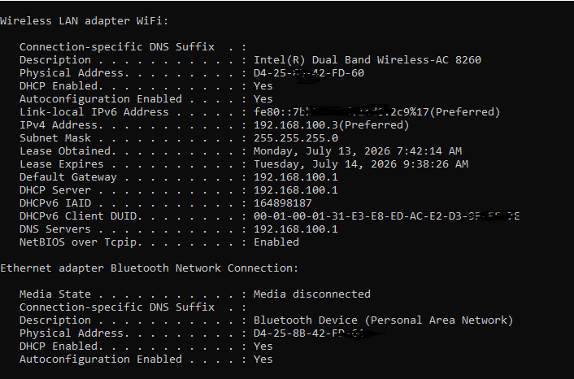
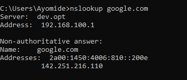
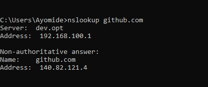
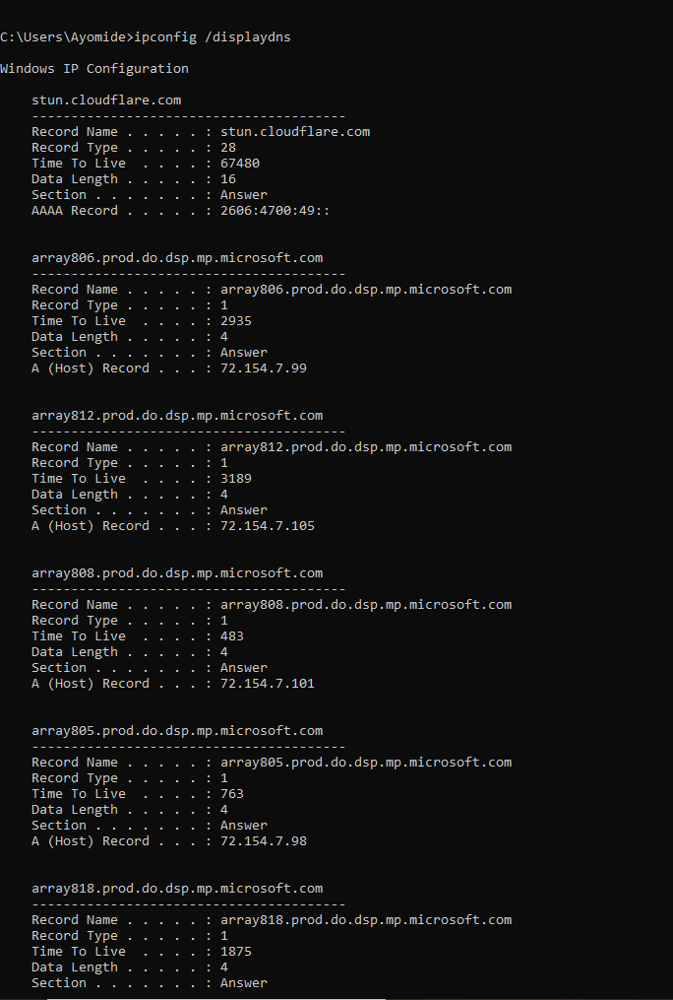
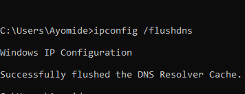

# Day 5 – DHCP, DNS & NAT

## 🎯 Objective

The objective of this lab was to understand how devices automatically obtain network configurations, how domain names are translated into IP addresses, and how multiple devices share a single public IP address to access the internet.

---

## 📚 Topics Covered

- Dynamic Host Configuration Protocol (DHCP)
- The DORA Process (Discover, Offer, Request, Acknowledge)
- Domain Name System (DNS)
- DNS Resolution
- Public vs Private IP Addresses
- Network Address Translation (NAT)
- DNS Cache
- Windows Networking Commands

---

## 🧠 Key Concepts Learned

### DHCP

DHCP (Dynamic Host Configuration Protocol) automatically assigns network configuration to devices joining a network. It provides:

- IP Address
- Subnet Mask
- Default Gateway
- DNS Server

The DHCP process follows four stages:

1. Discover
2. Offer
3. Request
4. Acknowledge (DORA)

---

### DNS

DNS (Domain Name System) translates human-readable domain names into IP addresses.

For example:

google.com → IP Address

Without DNS, users would have to memorize IP addresses instead of domain names.

---

### Public vs Private IP

**Private IP Address**

- Used inside local networks
- Not directly accessible from the Internet

Examples:

- 192.168.x.x
- 10.x.x.x
- 172.16.x.x – 172.31.x.x

**Public IP Address**

- Assigned by an Internet Service Provider (ISP)
- Used to identify a network on the Internet

---

### NAT

NAT (Network Address Translation) allows multiple devices within a private network to share a single public IP address when accessing the Internet.

This helps conserve IPv4 addresses and provides an additional layer of network abstraction.

---

## 💻 Commands Practiced

### Display complete network configuration

```cmd
ipconfig /all
```

Displays detailed information about network adapters, including IP address, subnet mask, default gateway, DHCP status, and DNS servers.

---

### Query DNS records

```cmd
nslookup google.com
```

Returns the IP address associated with the Google domain.

---

```cmd
nslookup github.com
```

Returns the IP address associated with GitHub.

---

### Display DNS cache

```cmd
ipconfig /displaydns
```

Displays DNS records currently stored in the local DNS cache.

---

### Clear DNS cache

```cmd
ipconfig /flushdns
```

Removes all cached DNS records from the local computer.

---

## 🧪 Practical Exercises Completed

- Viewed complete network configuration.
- Identified DHCP configuration.
- Identified DNS servers.
- Queried Google's DNS records.
- Queried GitHub's DNS records.
- Viewed cached DNS entries.
- Cleared the DNS cache successfully.

---

## 📸 Screenshots

### Network Configuration



---

### Google DNS Lookup



---

### GitHub DNS Lookup



---

### DNS Cache



---

### DNS Cache Flush



---

## 🎓 Key Takeaways

- DHCP automatically assigns network settings to devices.
- DNS translates domain names into IP addresses.
- NAT enables multiple devices to share a single public IP address.
- The DNS cache improves browsing performance by storing previously resolved domain names.
- Windows provides several built-in networking tools useful for troubleshooting and network analysis.

---

## 💭 Reflection

Today's lab helped me understand what happens behind the scenes when a device connects to a network and accesses websites on the Internet. I learned how DHCP automatically provides network settings, how DNS resolves domain names into IP addresses, and how NAT allows multiple devices to share one public IP address. Using commands like `ipconfig` and `nslookup` reinforced these concepts through hands-on practice and improved my understanding of real-world networking.