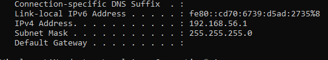
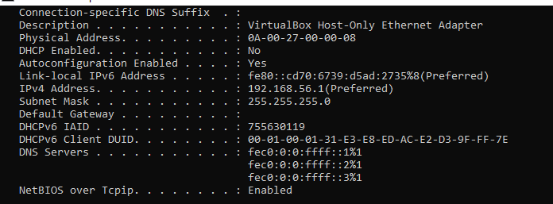
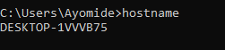
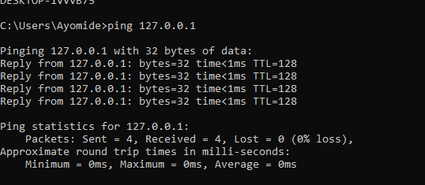

# 🌐 Networking Day 6 – IPv4 Addressing

## 📖 Overview

On Day 6, I learned the fundamentals of IPv4 addressing, including how IP addresses identify devices on a network, the structure of IPv4 addresses, public and private IP addresses, static and dynamic IP addresses, loopback addresses, APIPA, and the role of the default gateway.

I also practiced using Windows networking commands to inspect my system's network configuration.

---

## 🎯 Learning Objectives

- Understand what an IPv4 address is.
- Explain the structure of an IPv4 address.
- Differentiate between public and private IP addresses.
- Explain static and dynamic IP addressing.
- Understand the purpose of the loopback address (127.0.0.1).
- Learn what APIPA is and when it is used.
- Identify the role of the default gateway.

---

## 📚 Key Concepts

### IPv4 Address

An IPv4 address is a unique numerical identifier assigned to a device on a network. It enables devices to communicate by identifying the source and destination of network traffic.

Example:

```
192.168.100.25
```

An IPv4 address consists of **4 octets**, each ranging from **0–255**.

---

### Public vs Private IP Addresses

**Private IP Addresses**

Used within local networks such as homes, offices, and schools.

Private address ranges include:

- 10.0.0.0 – 10.255.255.255
- 172.16.0.0 – 172.31.255.255
- 192.168.0.0 – 192.168.255.255

**Public IP Addresses**

Assigned by an Internet Service Provider (ISP) and accessible over the Internet.

---

### Static vs Dynamic IP

**Static IP**

- Manually assigned
- Does not change
- Commonly used for servers and network devices

**Dynamic IP**

- Automatically assigned by DHCP
- Can change over time
- Commonly used for personal computers and mobile devices

---

### Loopback Address

The loopback address is:

```
127.0.0.1
```

It allows a computer to communicate with itself and is commonly used to test whether the TCP/IP stack is functioning correctly.

---

### APIPA

Automatic Private IP Addressing (APIPA) automatically assigns an IP address in the **169.254.x.x** range when a DHCP server cannot be reached.

---

### Default Gateway

The default gateway is the router that forwards traffic from a local network to other networks, including the Internet.

---

## 💻 Practical Commands

### Display IP Configuration

```cmd
ipconfig
```

Displays the IPv4 address, subnet mask, and default gateway.

**Screenshot**



---

### Display Complete Network Configuration

```cmd
ipconfig /all
```

Displays detailed information including DHCP status, MAC address, DNS servers, and lease information.

**Screenshot**



---

### Display Computer Name

```cmd
hostname
```

Displays the hostname of the computer.

**Screenshot**



---

### Test the Loopback Interface

```cmd
ping 127.0.0.1
```

Tests communication with the local computer to verify that the TCP/IP stack is functioning correctly.

**Screenshot**



---

## 📝 Summary

Today I learned how IPv4 addresses are structured and how they identify devices on a network. I understood the differences between public and private IP addresses, static and dynamic addressing, the purpose of the loopback address, APIPA, and the role of the default gateway. I also practiced using Windows networking commands to inspect and verify my computer's network configuration.

---

## ✅ Skills Gained

- IPv4 Addressing
- Public vs Private IP
- Static vs Dynamic IP
- Loopback Testing
- APIPA
- Default Gateway
- Windows Networking Commands