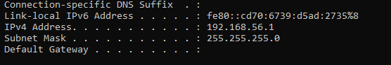
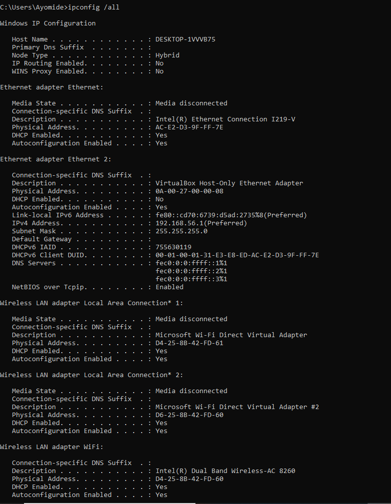
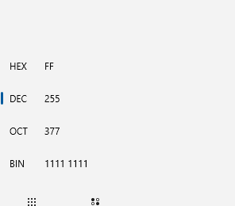

# 🌐 Networking Day 7 – Subnetting Part 1

## 📖 Overview

On Day 7, I began learning **Subnetting**, a fundamental networking concept used to divide a large network into smaller, more manageable subnets. I explored why subnetting is important, reviewed binary numbers, learned about CIDR notation, subnet masks, and the difference between network bits and host bits.

I also practiced viewing subnet information on my system and converting decimal values to binary using Windows Calculator.

---

## 🎯 Learning Objectives

- Understand what subnetting is.
- Explain why subnetting is important.
- Learn binary fundamentals.
- Understand CIDR notation.
- Understand prefix notation.
- Learn subnet masks.
- Differentiate between network bits and host bits.

---

## 📚 Key Concepts

### What is Subnetting?

Subnetting is the process of dividing a large network into smaller networks called **subnets**.

Subnetting helps improve:

- Network performance
- Security
- Network management
- Efficient IP address utilization

---

### Binary Numbers

Computers communicate using **binary (Base 2)**.

Binary consists of only two digits:

```
0
1
```

Binary place values:

```
128 64 32 16 8 4 2 1
```

Understanding binary is essential for learning subnetting.

---

### CIDR (Classless Inter-Domain Routing)

CIDR is a shorthand way of representing subnet masks.

Examples:

```
/8
/16
/24
/30
```

For example:

```
192.168.1.0/24
```

The **/24** indicates that the first 24 bits belong to the network, while the remaining bits are used for hosts.

---

### Subnet Mask

A subnet mask separates the **network portion** of an IP address from the **host portion**.

Example:

```
255.255.255.0
```

is equivalent to

```
/24
```

---

### Network Bits vs Host Bits

Network bits identify the network, while host bits identify individual devices within that network.

Example:

```
192.168.1.25/24
```

- First 24 bits → Network
- Last 8 bits → Host

---

## 💻 Practical Commands

### View Network Configuration

```cmd
ipconfig
```

Observed the subnet mask assigned to my computer.

**Screenshot**



---

### View Detailed Network Information

```cmd
ipconfig /all
```

Observed the IPv4 address together with the subnet mask.

**Screenshot**



---

### Binary Conversion

Used Windows Calculator (Programmer Mode) to convert decimal numbers into binary.

Converted:

- 192
- 168
- 10
- 255

**Screenshot**



---

## 📝 Summary

Today I learned the fundamentals of subnetting, including why networks are divided into smaller subnets, how binary numbers are used in networking, the purpose of CIDR notation, subnet masks, and how network bits differ from host bits. These concepts provide the foundation for solving subnetting problems in the next lesson.

---

## ✅ Skills Gained

- Subnetting Fundamentals
- Binary Basics
- CIDR Notation
- Prefix Notation
- Subnet Masks
- Network Bits vs Host Bits
- Windows Networking Commands