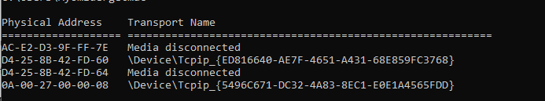
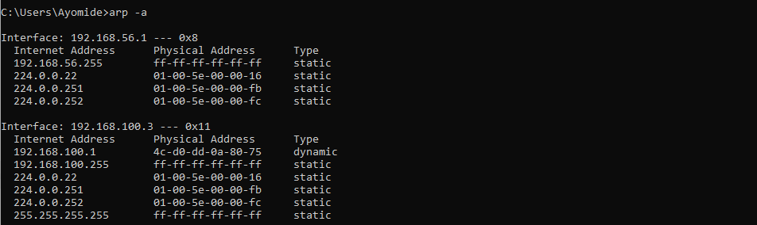

# Day 09 – MAC Addresses & ARP

## Objective

To understand how devices communicate within a Local Area Network (LAN) using MAC addresses and the Address Resolution Protocol (ARP), and to explore how switches forward network traffic efficiently.

---

## Topics Covered

- MAC (Media Access Control) Address
- IP Address vs MAC Address
- Address Resolution Protocol (ARP)
- ARP Request & ARP Reply
- ARP Cache
- CAM (Content Addressable Memory) Table
- Switch Learning (MAC Learning)
- ARP Spoofing (Concept)

---

## Key Concepts Learned

### MAC Address

A MAC (Media Access Control) Address is a unique 48-bit hexadecimal identifier assigned to a device's Network Interface Card (NIC). It serves as the physical address of a device and is used for communication within a Local Area Network (LAN).

Example:

00:15:5D:3A:18:9F

---

### IP Address vs MAC Address

| IP Address | MAC Address |
|------------|-------------|
| Logical Address | Physical Address |
| Used to identify devices across networks | Used to identify devices within a local network |
| Can change (Static or Dynamic) | Usually permanent |
| Operates at Layer 3 (Network Layer) | Operates at Layer 2 (Data Link Layer) |

---

### Address Resolution Protocol (ARP)

ARP (Address Resolution Protocol) translates an IP address into its corresponding MAC address so that devices on the same local network can communicate.

ARP Process:

1. ARP Request – The sender broadcasts a request asking, "Who has this IP address?"
2. ARP Reply – The device with the requested IP responds with its MAC address.
3. The sender stores the mapping in its ARP Cache for future communication.

---

### ARP Cache

The ARP Cache is a temporary table stored on a device that keeps recently resolved IP addresses and their corresponding MAC addresses. This reduces the need to send repeated ARP requests and improves communication efficiency.

---

### CAM Table

A CAM (Content Addressable Memory) Table, also known as a MAC Address Table, is maintained by a network switch. It stores MAC addresses and the switch ports they are connected to, allowing the switch to forward traffic only to the correct destination.

---

### Switch Learning

A network switch learns MAC addresses by examining the source MAC address of incoming Ethernet frames. It records the MAC address and the port on which the frame arrived in its CAM Table, enabling efficient forwarding of future traffic.

---

### ARP Spoofing

ARP Spoofing (ARP Poisoning) is an attack where an attacker sends forged ARP messages to associate their own MAC address with another device's IP address. This allows the attacker to intercept or manipulate network traffic and is commonly used in Man-in-the-Middle (MITM) attacks.

---

## Practical Exercises

Windows Commands Executed:

```cmd
getmac
```

Displays the MAC address of the network adapters on the system.

```cmd
arp -a
```

Displays the contents of the ARP Cache, showing the mapping between IP addresses and MAC addresses.

---

## Key Takeaways

- Every network device has a unique MAC address.
- IP addresses identify devices across networks, while MAC addresses identify devices on the local network.
- ARP resolves IP addresses into MAC addresses.
- ARP Cache improves network efficiency by storing recently resolved mappings.
- Switches use CAM Tables to forward traffic intelligently.
- ARP Spoofing is a common technique used in Man-in-the-Middle attacks.

---

## Screenshots

### getmac Command

Displays the MAC addresses of the network adapters installed on my system.



---

### arp -a Command

Displays the contents of the ARP Cache, showing the mapping between IP addresses and their corresponding MAC addresses.



---

## Skills Gained

- MAC Address Identification
- ARP Fundamentals
- LAN Communication
- Switch Learning
- Network Troubleshooting Basics
- Understanding Layer 2 Communication