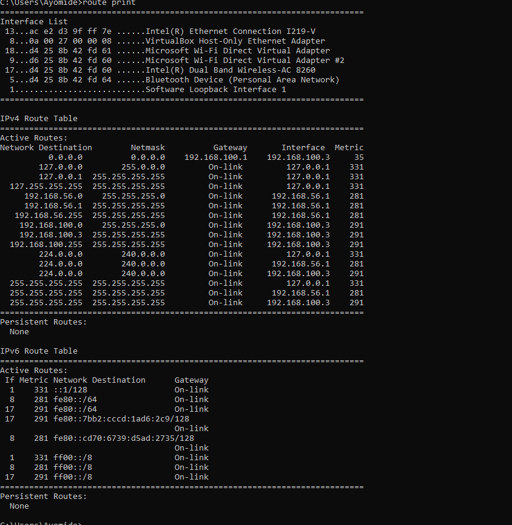
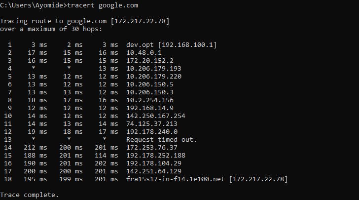
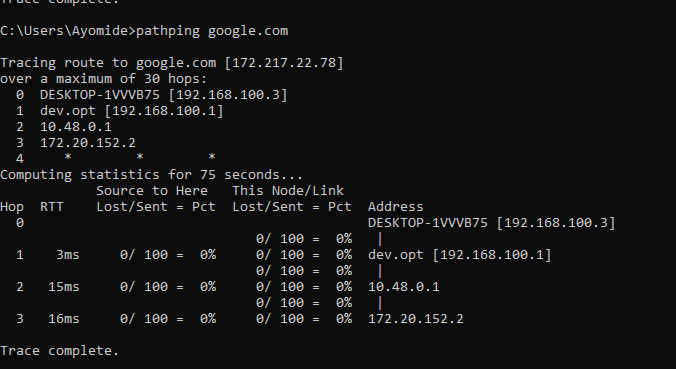

# Day 10 – Routing

## Objective

To understand how data travels between different networks through routing, the role of routers and default gateways, how routing tables determine packet paths, and the purpose of TTL and ICMP in network communication and troubleshooting.

---

## Topics Covered

- Routing
- Routers
- Routing Tables
- Default Gateway
- Static Routing
- Dynamic Routing
- Time To Live (TTL)
- Internet Control Message Protocol (ICMP)

---

## Key Concepts Learned

### Routing

Routing is the process of selecting the best path for a data packet to travel from one network to another until it reaches its destination. Routers perform this task using routing tables.

---

### Router

A router is a Layer 3 (Network Layer) device that connects different networks and forwards packets based on their destination IP addresses.

Unlike a switch, which forwards frames within the same local network using MAC addresses, a router enables communication between different networks.

---

### Routing Table

A routing table is a collection of routes stored on a router or computer. It contains information about destination networks, gateways, interfaces, and metrics that help determine the best path for forwarding packets.

---

### Default Gateway

A default gateway is the router a device sends packets to when the destination is outside its local network. It acts as the exit point from a local network to external networks such as the internet.

---

### Static Routing

Static routing is manually configured by a network administrator.

**Advantages**
- Simple to configure
- Predictable
- More secure

**Disadvantages**
- Does not update automatically
- Difficult to manage in large networks

---

### Dynamic Routing

Dynamic routing allows routers to automatically exchange routing information and determine the best available paths using routing protocols such as RIP, OSPF, EIGRP, and BGP.

It is commonly used in medium and large networks.

---

### Time To Live (TTL)

TTL (Time To Live) is a value stored in every IP packet that determines the maximum number of routers (hops) the packet can pass through before it is discarded.

Each router decreases the TTL by one. If the TTL reaches zero before reaching the destination, the packet is dropped to prevent routing loops.

---

### Internet Control Message Protocol (ICMP)

ICMP (Internet Control Message Protocol) is used for network diagnostics, control messages, and error reporting.

It is commonly used by tools such as **ping** and **tracert** to test connectivity and identify network paths.

---

## Practical Exercises

### Display the Routing Table

```cmd
route print
```

Displays the computer's routing table, including destination networks, gateways, interfaces, and route metrics.

---

### Trace the Route to Google

```cmd
tracert google.com
```

Displays the sequence of routers (hops) that packets pass through to reach Google's servers.

---

### Analyze Network Path

```cmd
pathping google.com
```

Combines the functionality of **ping** and **tracert** by displaying the route to the destination while also measuring packet loss and latency at each hop.

---

## Key Takeaways

- Routers connect different networks.
- Routing determines the best path for data packets.
- Routing tables store available routes.
- The default gateway forwards traffic destined for external networks.
- Static routes are manually configured, while dynamic routes update automatically.
- TTL prevents packets from looping indefinitely.
- ICMP is used for diagnostics and troubleshooting.
- Commands such as `route print`, `tracert`, and `pathping` help analyze network communication.

---

## Screenshots

### route print

Displays the routing table of the local machine.



---

### tracert google.com

Shows the route packets take to reach Google's servers.



---

### pathping google.com

Displays the route, packet loss, and latency information for each hop.



---

## Skills Gained

- Routing Fundamentals
- Router Operations
- Reading Routing Tables
- Understanding Default Gateways
- Static vs Dynamic Routing
- TTL Concepts
- ICMP Fundamentals
- Network Path Analysis
- Windows Network Troubleshooting