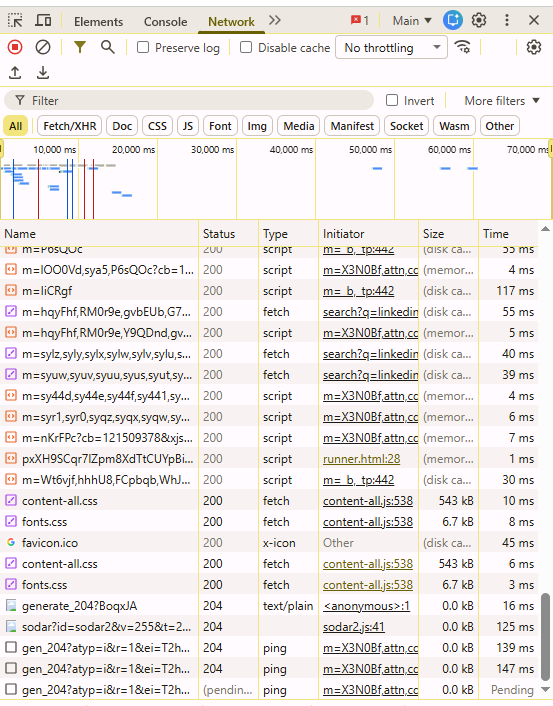
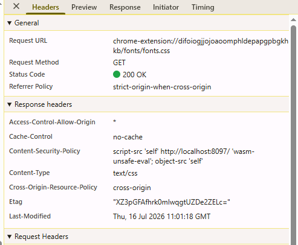

# Day 11 – HTTP

## Objective

To understand how web browsers and web servers communicate using HTTP, the structure of URLs, HTTP methods, headers, cookies, sessions, status codes, and the basics of REST APIs.

---

## Topics Covered

- HTTP (HyperText Transfer Protocol)
- Client vs Server
- HTTP Request & Response
- URL Structure
- HTTP Methods
- HTTP Headers
- Cookies
- Sessions
- HTTP Status Codes
- REST APIs (Introduction)

---

## Key Concepts Learned

### HTTP

HTTP (HyperText Transfer Protocol) is an application-layer protocol that defines how web clients (browsers) and web servers communicate to request and transfer web resources.

---

### Client vs Server

A **client** is the device or application requesting information, such as a web browser.

A **server** is the computer or application that stores resources and responds to client requests.

---

### HTTP Request & Response

Communication over HTTP follows a request-response model.

- The client sends an **HTTP Request**.
- The server processes the request.
- The server returns an **HTTP Response** containing the requested resource or a status code.

---

### URL Structure

Example:

```
https://www.example.com/products?id=10
```

Components:

- Protocol → `https`
- Domain → `www.example.com`
- Path → `/products`
- Query Parameter → `?id=10`

---

### HTTP Methods

| Method | Purpose |
|---------|----------|
| GET | Retrieve data |
| POST | Create or submit data |
| PUT | Update existing data |
| DELETE | Remove data |

---

### HTTP Headers

HTTP headers contain additional information about requests and responses.

Examples include:

- User-Agent
- Accept
- Content-Type
- Cookie
- Server

Headers help clients and servers understand how to process the communication.

---

### Cookies

Cookies are small pieces of data stored in a user's browser to remember information such as login sessions and user preferences.

---

### Sessions

Sessions store user-related information on the server. The browser typically stores only a session ID, allowing the server to identify the user across multiple requests.

---

### Common HTTP Status Codes

| Status Code | Meaning |
|--------------|---------|
| 200 | OK |
| 204 | No Content |
| 301 | Moved Permanently |
| 302 | Temporary Redirect |
| 403 | Forbidden |
| 404 | Not Found |
| 500 | Internal Server Error |

---

### REST APIs

A REST API allows different applications to communicate over HTTP using methods such as GET, POST, PUT, and DELETE to retrieve, create, update, or delete resources.

---

## Practical Exercise

Using Chrome Developer Tools:

- Opened the **Network** tab.
- Refreshed a webpage.
- Inspected HTTP requests.
- Observed:
  - Request Method
  - Status Code
  - Request Headers
  - Response Headers

---

## Key Takeaways

- HTTP is the protocol used for communication between browsers and web servers.
- Every webpage visit involves an HTTP request and response.
- HTTP methods define the action being performed.
- Headers provide additional request and response information.
- Cookies and sessions help websites remember users.
- HTTP status codes indicate the outcome of requests.
- REST APIs enable communication between different applications using HTTP.

---

## Screenshots

### Network Requests

Shows HTTP requests made when loading a webpage.



---

### HTTP Request Details

Shows the request URL, request method, status code, and HTTP headers.



---

## Skills Gained

- Understanding HTTP Communication
- Browser Developer Tools
- Request & Response Analysis
- HTTP Methods
- Status Code Interpretation
- Cookies & Sessions
- Introduction to REST APIs