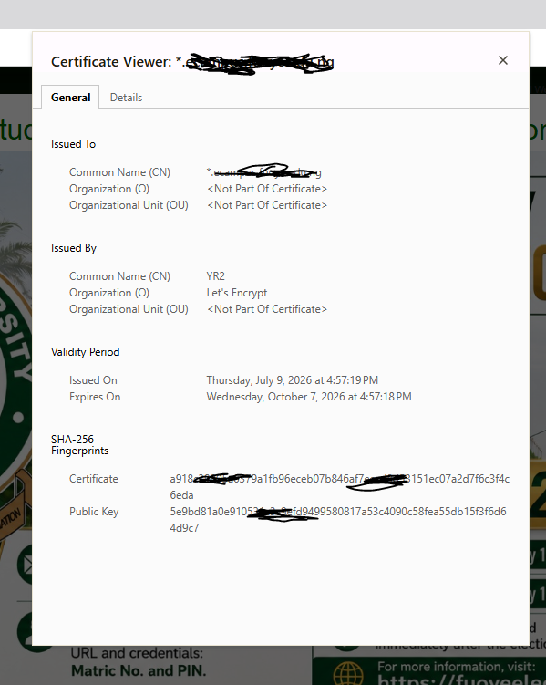

# Day 12 – HTTPS & TLS

## Objective

To understand how HTTPS secures web communication using TLS, encryption, digital certificates, and certificate authorities.

---

## Topics Covered

- HTTP vs HTTPS
- Encryption
- Plaintext vs Ciphertext
- Symmetric Encryption
- Asymmetric Encryption
- Public Key
- Private Key
- TLS
- SSL vs TLS
- Digital Certificates
- Certificate Authorities (CA)
- TLS Handshake
- Man-in-the-Middle (MITM) Attack

---

## Key Concepts Learned

### HTTPS

HTTPS (HyperText Transfer Protocol Secure) is the secure version of HTTP. It uses TLS to encrypt communication between a client and a web server.

---

### HTTP vs HTTPS

| HTTP | HTTPS |
|------|-------|
| No encryption | Encrypted communication |
| Less secure | More secure |
| Vulnerable to interception | Protects data in transit |

---

### Encryption

Encryption is the process of converting readable data (plaintext) into unreadable data (ciphertext) to protect it from unauthorized access.

---

### Symmetric Encryption

Symmetric encryption uses the same secret key for both encryption and decryption. It is fast and efficient for securing large amounts of data.

---

### Asymmetric Encryption

Asymmetric encryption uses two keys:

- Public Key
- Private Key

The public key encrypts data, while the private key decrypts it.

---

### Digital Certificates

Digital certificates verify the identity of websites and confirm that their public keys belong to the legitimate owner.

---

### Certificate Authority (CA)

Certificate Authorities are trusted organizations that issue and verify digital certificates.

Example:

- Let's Encrypt

---

### TLS

Transport Layer Security (TLS) is the protocol that secures HTTPS by providing encryption, authentication, and data integrity.

---

### SSL vs TLS

SSL is obsolete.

TLS is the modern and more secure protocol used by HTTPS.

---

### TLS Handshake

During the TLS handshake:

1. The browser connects to the server.
2. The server sends its digital certificate and public key.
3. The browser verifies the certificate.
4. A secure session key is established.
5. Encrypted communication begins.

---

### Man-in-the-Middle (MITM) Attack

A MITM attack occurs when an attacker intercepts communication between a client and a server. HTTPS helps prevent attackers from reading intercepted data by encrypting the communication.

---

## Practical Exercise

Using a web browser, I:

- Verified that websites use HTTPS.
- Inspected a website's TLS certificate.
- Identified the issuing Certificate Authority.
- Observed the certificate validity period.
- Examined certificate details and public key information.

---

## Key Takeaways

- HTTPS protects web communication using TLS.
- Encryption converts plaintext into ciphertext.
- Public and private keys enable secure key exchange.
- Digital certificates verify website identity.
- Certificate Authorities issue trusted certificates.
- TLS provides confidentiality, authentication, and integrity.
- HTTPS helps defend against Man-in-the-Middle attacks.

---

## Screenshots

### TLS Certificate

Shows the website's digital certificate, issuing Certificate Authority, and validity period.

---

## Skills Gained

- HTTPS Fundamentals
- TLS Concepts
- Encryption Basics
- Certificate Validation
- Browser Security Inspection
- Digital Certificate Analysis