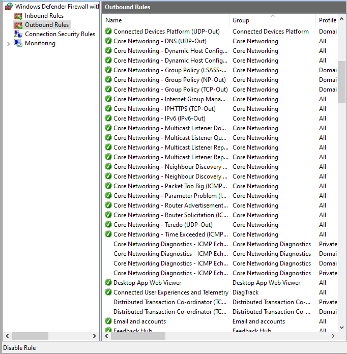
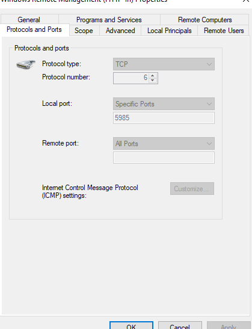

# Day 13 – Firewalls

## Objective

To understand how firewalls protect systems and networks by monitoring and controlling network traffic based on predefined security rules.

---

## Topics Covered

- Firewalls
- Packet Filtering
- Stateful Firewalls
- Next-Generation Firewalls (NGFW)
- Windows Defender Firewall
- Inbound Traffic
- Outbound Traffic
- Firewall Rules

---

## Key Concepts Learned

### What is a Firewall?

A firewall is a security system that monitors and controls incoming and outgoing network traffic based on predefined security rules.

It determines whether traffic should be allowed or blocked.

---

### Why Firewalls Are Important

Firewalls help protect systems and networks from unauthorized access and unwanted network connections.

For example, if Remote Desktop is not enabled on a computer, an unexpected connection attempt to TCP port 3389 can be blocked by a firewall rule.

---

### Packet Filtering

Packet filtering is a basic firewall technique that examines individual packets based on information such as:

- Source IP address
- Destination IP address
- Source port
- Destination port
- Protocol (TCP/UDP)

The firewall compares this information against its rules and decides whether to allow or block the traffic.

---

### Stateful Firewalls

A stateful firewall tracks the state of active network connections.

For example, if a computer initiates a connection to a web server, the firewall keeps track of that connection and can recognize the server's response as part of an established connection.

---

### Next-Generation Firewalls (NGFW)

Next-Generation Firewalls provide advanced security capabilities beyond traditional packet filtering.

Features may include:

- Application awareness
- Deep Packet Inspection (DPI)
- Intrusion Prevention System (IPS)
- Malware detection
- URL filtering

---

### Windows Defender Firewall

Windows includes a built-in firewall that manages network traffic using firewall rules.

Firewall rules can specify:

- Allow or Block
- Inbound or Outbound traffic
- TCP or UDP protocols
- Local ports
- Remote ports
- IP addresses

---

### Inbound Traffic

Inbound traffic is network traffic coming **into** a computer or network.

Example:

    Internet → Computer

---

### Outbound Traffic

Outbound traffic is network traffic leaving a computer or network.

Example:

    Computer → Internet

---

### Firewall Rules

Firewall rules define how network traffic should be handled.

For example:

    Allow TCP port 443
    Block TCP port 23
    Block unauthorized inbound connections

---

## Practical Exercise

Using Windows Defender Firewall with Advanced Security, I inspected:

- Inbound Rules
- Outbound Rules
- Firewall rule properties
- Protocols
- Ports
- Allow/Block actions

This helped me understand how Windows controls network traffic using firewall rules.

---

## Key Takeaways

- Firewalls monitor and control network traffic.
- Packet filtering examines traffic using IP addresses, ports, and protocols.
- Stateful firewalls track active network connections.
- NGFWs provide advanced traffic inspection and security capabilities.
- Inbound traffic enters a system, while outbound traffic leaves it.
- Windows Defender Firewall uses rules to control network communication.
- Firewall rules can allow or block specific traffic based on defined conditions.

---

## Screenshots

### Windows Firewall Inbound Rules

---

### Firewall Rule Properties

---

## Skills Gained

- Firewall Fundamentals
- Packet Filtering
- Stateful Firewall Concepts
- Next-Generation Firewall Concepts
- Windows Firewall
- Inbound vs Outbound Traffic
- Firewall Rule Analysis