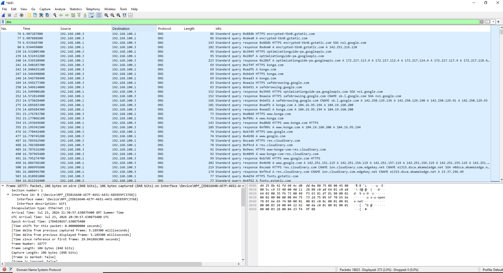
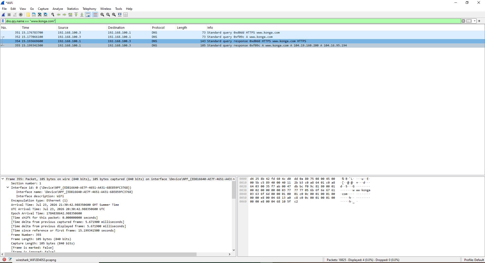
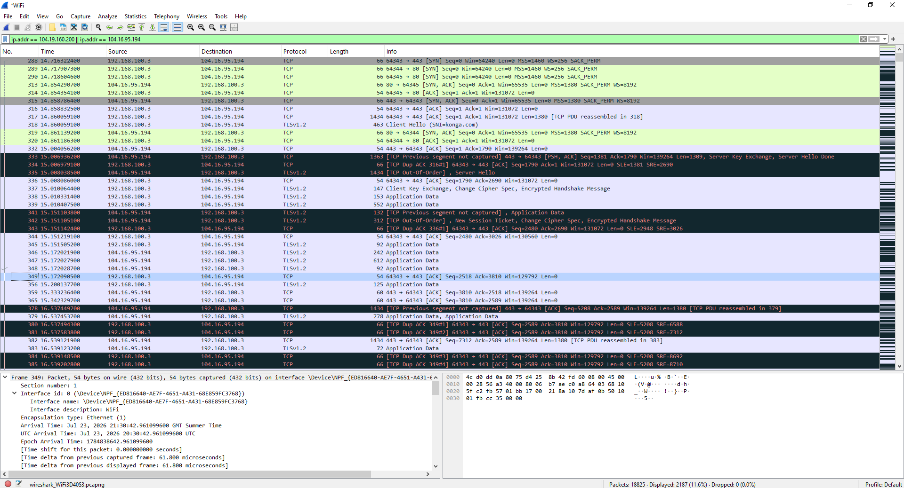
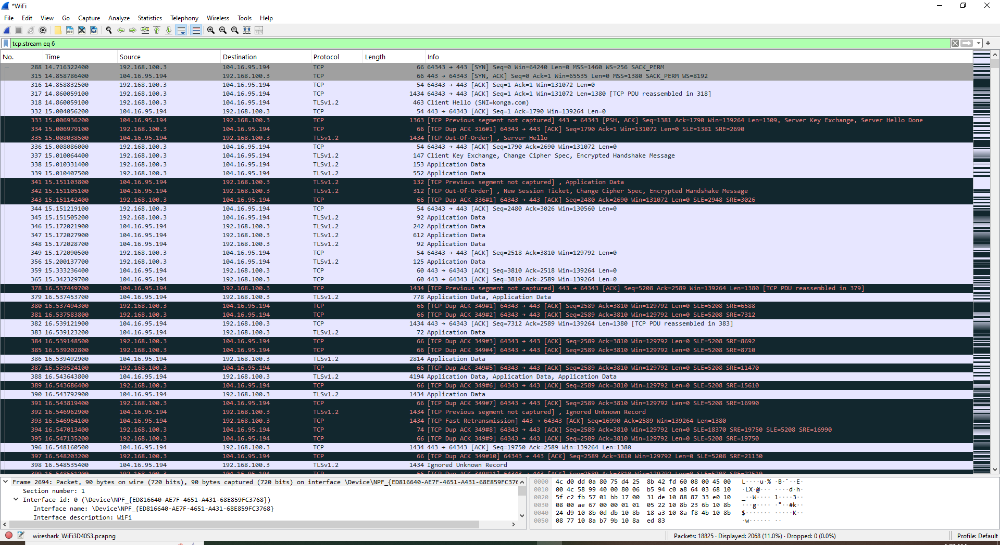
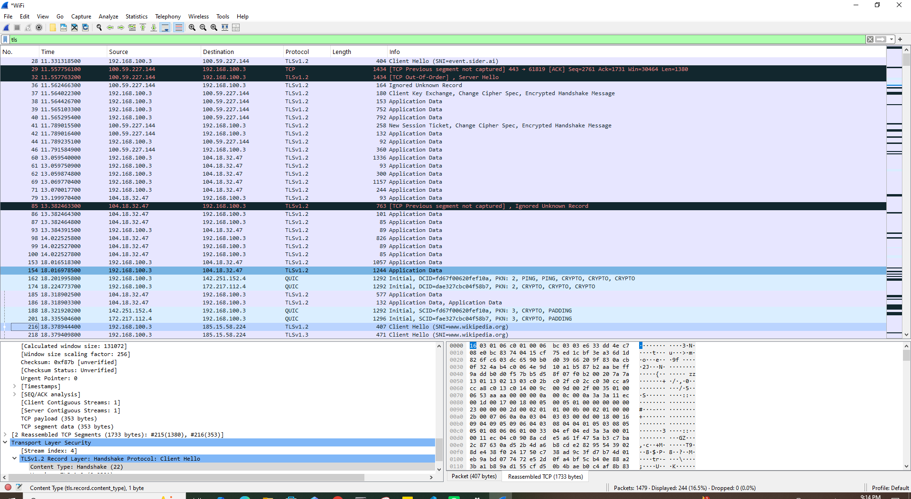
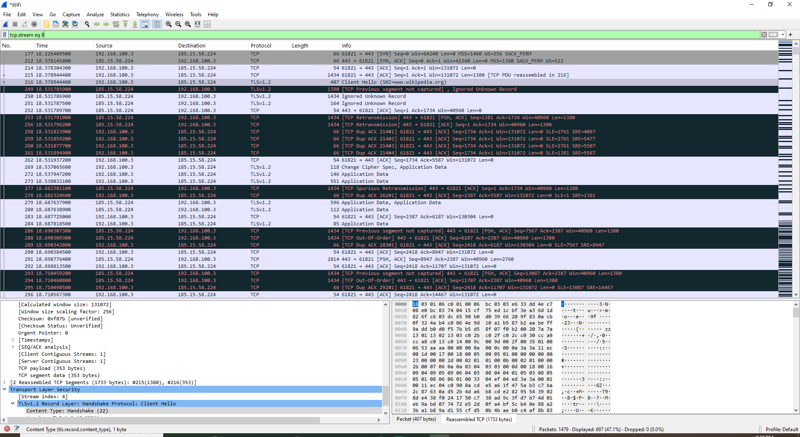

# Day 15 – Wireshark DNS, TCP, TLS and Retransmission Analysis

## Objective

The objective of this lab was to investigate real network traffic using Wireshark and develop practical skills in packet analysis.

The analysis focused on:

- DNS queries and responses
- Domain name resolution
- Identifying IP addresses associated with a domain
- TCP connections
- TCP stream analysis
- HTTPS and TLS traffic
- TLS Client Hello and Server Name Indication (SNI)
- Encrypted application data
- TCP retransmissions
- Fast retransmissions
- Spurious retransmissions
- Packet-level TCP analysis

---

## Tools Used

- Wireshark
- Windows 10
- Web browser
- Internet connection

---

## Practical Exercises

### 1. DNS Traffic Analysis

I captured live network traffic and filtered DNS packets in Wireshark.

I analyzed DNS queries and responses to understand how a domain name is resolved to an IP address before a connection is established.

I investigated DNS traffic associated with:

- `konga.com`
- `www.konga.com`

The DNS response provided IP addresses associated with the requested domain.

#### Key Observation

DNS resolution occurs before the subsequent connection to the remote server. By analyzing the DNS traffic, I was able to identify the IP addresses returned for the requested domain.

#### Screenshot




---

### 2. Connecting DNS Resolution to TLS Traffic

After identifying the IP addresses returned through DNS resolution, I filtered network traffic associated with the identified IP addresses.

This allowed me to observe the subsequent TCP and TLS traffic generated after the DNS resolution process.

#### Key Observation

The analysis demonstrated the relationship between:

1. DNS query
2. DNS response
3. IP address resolution
4. TCP connection
5. TLS handshake
6. Encrypted application traffic

#### Screenshot



---

### 3. TCP Stream Analysis

I investigated a TCP stream associated with HTTPS traffic using the Wireshark TCP stream filtering functionality.

The TCP stream showed communication between my local system and the remote server over TCP port 443.

The analysis revealed:

- TCP connection establishment
- Data exchange between client and server
- TLS handshake traffic
- Encrypted application data
- TCP acknowledgements
- Retransmitted segments

#### Key Observation

Following a TCP stream makes it easier to analyze a specific communication session rather than examining individual packets in isolation.

#### Screenshot



---

### 4. TLS and HTTPS Traffic Analysis

I filtered TLS traffic using:

```text
tls
```

I then examined the TLS handshake and encrypted application data.

The captured traffic contained TLS 1.2 communication.

I identified a TLS Client Hello packet containing the Server Name Indication (SNI) associated with:

`konga.com`

The TLS traffic also contained Application Data packets.

#### Key Observation

Although HTTPS encrypts the application data, Wireshark can still identify the TLS protocol and display certain connection metadata.

The actual application payload could not be directly read because it was encrypted.

#### Screenshot




---

### 5. TCP Retransmission Analysis

I used the following Wireshark display filter:

```text
tcp.analysis.retransmission
```

This filter allowed me to identify packets that Wireshark classified as TCP retransmissions.

I observed several types of TCP retransmission-related events, including:

- TCP Retransmission
- TCP Fast Retransmission
- TCP Spurious Retransmission

I then narrowed the analysis to HTTPS traffic using:

```text
tcp.analysis.retransmission && tcp.port == 443
```

This allowed me to investigate retransmission events occurring on HTTPS connections.

#### Key Observation

TCP retransmissions can occur when previously transmitted data is believed to have been lost or not successfully acknowledged.

However, the presence of retransmissions alone does not necessarily indicate a security incident or server failure. They may occur due to packet loss, network conditions, timing, or limitations of the packet capture.

#### Screenshot


---

### 6. Packet-Level TCP Investigation

I selected individual TCP packets and examined their detailed protocol information.

The analysis included:

- Source and destination IP addresses
- Source and destination ports
- TCP sequence numbers
- Acknowledgement numbers
- TCP flags
- TCP payload length
- Stream index
- Retransmitted TCP segments

I also examined Wireshark's TCP analysis information to understand how the application and transport layers interacted during the communication.

#### Key Observation

Packet-level analysis provides deeper visibility into how TCP manages reliable data delivery and identifies situations where segments may need to be retransmitted.

---

### 7. Additional HTTPS Traffic Analysis

I also examined HTTPS traffic associated with another website to compare TLS and TCP traffic patterns.

This provided an opportunity to observe that HTTPS traffic generally follows the same broad communication process:

```text
DNS Resolution
      ↓
TCP Connection
      ↓
TLS Handshake
      ↓
Encrypted Application Data
```

#### Screenshot



---

## Key Findings

During this lab, I learned that:

- DNS translates domain names into IP addresses that can be used to establish network connections.
- DNS traffic can be analyzed in Wireshark using protocol-specific display filters.
- After DNS resolution, the client establishes a TCP connection with the remote server.
- HTTPS communication commonly uses TCP port 443.
- TLS protects application data by encrypting the communication.
- Wireshark can still identify TLS traffic and display certain metadata even when the application payload is encrypted.
- The TLS Client Hello can contain information such as the Server Name Indication (SNI).
- TCP retransmissions can be identified using Wireshark's TCP analysis filters.
- TCP retransmissions are not automatically evidence of an attack or server failure.
- Following a TCP stream provides a better view of a specific network conversation.
- Packet-level analysis helps explain how TCP handles sequencing, acknowledgements, and retransmission.

---

## Lessons Learned

This lab improved my ability to investigate network traffic systematically.

I learned to start with a domain name, observe its DNS resolution, identify the resulting IP addresses, and then follow the traffic through TCP and TLS.

I also learned that network analysis requires careful interpretation. A Wireshark warning such as a retransmission or a missing segment should not immediately be interpreted as malicious activity. The surrounding network context must be considered before drawing conclusions.

---

## Reflection

This lab helped me understand how different networking protocols work together during a typical HTTPS connection.

Before this exercise, I understood DNS, TCP, and HTTPS mainly as individual concepts. Through practical packet analysis, I was able to observe how they interact in a real network communication process.

The exercise also strengthened my understanding of Wireshark as a cybersecurity investigation tool. I learned how to use display filters, follow TCP streams, inspect packet details, and investigate TCP retransmission events.

This experience has improved my ability to analyze network traffic and provides a foundation for future cybersecurity work involving network monitoring, incident detection, and security analysis.

---

## Evidence

All screenshots captured during this practical exercise are stored in the `screenshots/` directory.

The evidence includes:

- DNS traffic analysis
- Konga DNS query and response
- DNS-to-TLS connection analysis
- TLS traffic overview
- TLS Client Hello analysis
- TCP stream analysis
- TCP retransmission analysis
- TCP packet-level analysis
- Additional TLS and TCP analysis using Wikipedia traffic